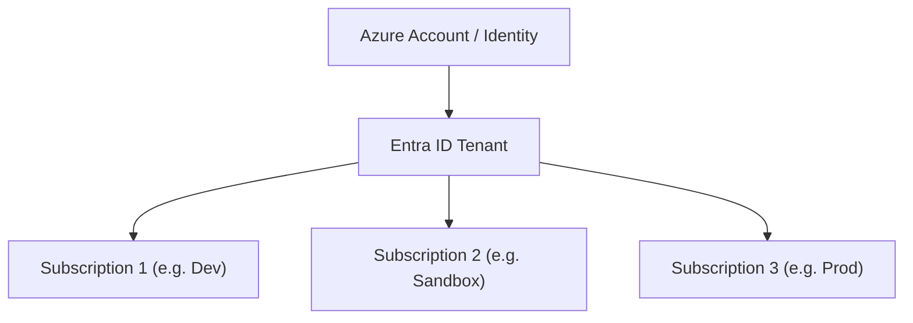

# LAB-000: Azure Subscription Management

## 🎯 Lab Objective
The objective of this lab is to practice listing, inspecting, and switching between different **Azure Subscriptions** inside your account using both the **Azure CLI** and **PowerShell**. 

---

## 🗺️ Subscription Architecture

An Azure account can have access to multiple **Subscriptions** managed under one or more **Entra ID Tenants**. Only one subscription is active (the default) at any given time in your CLI session.



---

## 🤝 AWS to Azure Mapping

| AWS Concept | Azure Concept | Description |
| :--- | :--- | :--- |
| AWS IAM Account / Org Account | Azure Subscription | The boundary for resource grouping, billing, and access. |
| AWS profiles (`~/.aws/credentials`) | CLI Subscription Context | Configured profile to switch CLI command destinations. |
| `aws configure set profile` | `az account set` | The action to change the active target context. |

---

## 🚀 Step-by-Step Instructions

### 1. Prerequisites & Login
Before starting, ensure you have the Azure CLI installed.
1. Open a PowerShell terminal.
2. Verify you can run the Azure CLI:
   ```powershell
   az --version
   ```
3. **Log in or Switch Accounts**:
   *   To log in with a new user account (browser-based):
       ```powershell
       az login
       ```
   *   **Device Code Flow** (Alternative - great if the browser fails to open or is blocked):
       ```powershell
       az login --use-device-code
       ```
       *This will give you a code and tell you to go to `https://microsoft.com/devicelogin` in any browser (even on your phone) to authenticate.*
   *   To log in using a **Service Principal** (for automation/pipelines):
       ```powershell
       az login --service-principal -u "APP_ID" -p "CLIENT_SECRET" --tenant "TENANT_ID"
       ```
   *   To log in using an Azure resource's **Managed Identity** (when running inside Azure VMs/runtimes):
       ```powershell
       az login --identity
       ```
   *   To log out of your current account completely:
       ```powershell
       az logout
       ```
   *   To log in directly to a specific Entra ID Tenant directory:
       ```powershell
       az login --tenant "YOUR_TENANT_ID_OR_DOMAIN"
       ```
   *   To see all identities you are currently logged in with:
       ```powershell
       az account tenant list
       ```

### 2. Run the Inspection Script
1. Navigate to this lab folder:
   ```powershell
   cd az-labs/lab-000-subscription-management
   ```
2. Execute the inspection script:
   ```powershell
   .\deploy.ps1
   ```
   *This script checks if you are logged in, shows your active subscription, and outputs a formatted table of all subscriptions you have access to.*

### 3. Practice CLI Commands (Manual Practice)
Try running these commands in your PowerShell terminal to learn how to manage subscriptions manually:

*   **List all subscriptions**:
    ```powershell
    az account list --output table
    ```
*   **Show the active default subscription**:
    ```powershell
    az account show --output json
    ```
*   **Switch to a different subscription (by ID or Name)**:
    ```powershell
    az account set --subscription "YOUR_SUBSCRIPTION_NAME_OR_ID"
    ```
*   **Verify the switch**:
    ```powershell
    az account show --query name -o tsv
    ```

### 4. Practice PowerShell Az Module Commands (Alternative)
If you use the Azure PowerShell Module (`Az`), practice these equivalents:

*   **List all subscriptions**:
    ```powershell
    Get-AzSubscription | Format-Table
    ```
*   **Show current context**:
    ```powershell
    Get-AzContext
    ```
*   **Switch active context**:
    ```powershell
    Set-AzContext -Subscription "YOUR_SUBSCRIPTION_NAME_OR_ID"
    ```

---

## 🔍 Verification Steps
Run `az account show --output table`. If your active subscription changed to the target one, the lab is successful!

## 🧹 Cleanup
Since no cloud resources were deployed in this lab, simply close your terminal or run:
```powershell
.\destroy.ps1
```
