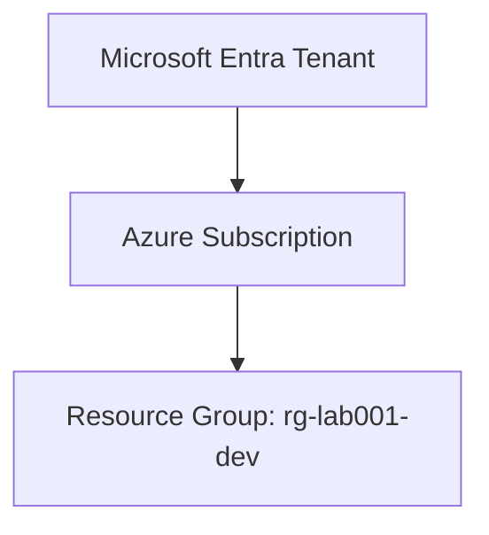

# LAB-001: Azure Subscription & Sandbox Setup

## 🎯 Lab Objective
The objective of this lab is to establish your local Azure CLI authentication context, understand the subscription hierarchy, and deploy a basic resource group scope boundary using **Bicep** and **PowerShell**.

---

## 🗺️ Management hierarchy



---

## 🤝 AWS to Azure Mapping

| AWS Concept | Azure Concept | Description |
| :--- | :--- | :--- |
| AWS Account | Azure Subscription | The billing and access boundary for cloud resources. |
| AWS Organization / OUs | Management Groups | Logical hierarchies to manage policies and access across multiple subscriptions/accounts. |
| IAM Role / Policy | Role-Based Access Control (RBAC) | Securing resource operations by mapping identities to specific capabilities. |
| CloudFormation Stack Boundary | Resource Group | A logical container holding related resources that share a lifecycle. |

---

## 🚀 Step-by-Step Instructions

### 1. Prerequisites & Login
Before starting, ensure you have the Azure CLI installed.
1. Open a PowerShell terminal.
2. Verify you can run the Azure CLI:
   ```powershell
   az --version
   ```
3. Run the login command:
   ```powershell
   az login
   ```
   *Note: This will open your web browser. Log in with your Azure sandbox/personal credentials.*

### 2. Run the Deployment Script
1. Navigate to this lab folder:
   ```powershell
   cd az-labs/lab-001-sandbox-setup
   ```
2. Execute the PowerShell script to deploy the resource group using Bicep:
   ```powershell
   .\deploy.ps1
   ```
   *This script checks your login state, reads `main.bicep`, and deploys the resource group `rg-lab001-dev` in the `westeurope` region at the subscription target scope.*

### 3. Verify Deployment
1. Verify the resource group exists using the Azure CLI:
   ```powershell
   az group show --name rg-lab001-dev
   ```
2. Look at the properties output to verify the tags: `Environment: Dev` and `Lab: 001`.

### 4. Clean Up
To prevent any future resource usage or clutter, run the cleanup script:
```powershell
.\destroy.ps1
```
*This command sends a deletion signal to Azure to asynchronously delete the resource group. You can verify it is deleted by running `az group list`.*

---

## 🔍 Verification Steps
When successfully deployed, `az group show --name rg-lab001-dev` will return a JSON body showing:
*   `provisioningState`: `Succeeded`
*   `location`: `westeurope`
*   `tags`: `{ "Environment": "Dev", "Lab": "001", "Project": "Learning" }`
