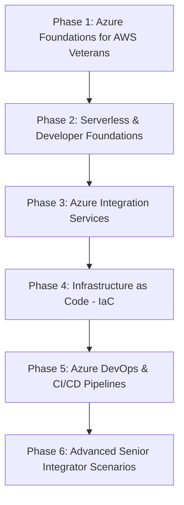

# Azure DevOps & Integration Hands-On Learning Roadmap

Welcome, Java! This roadmap is designed to fast-track your Azure DevOps, Development, and Administration skills, leveraging your existing AWS knowledge. It is optimized to support completing **3 to 4 labs a day**, taking you from basic cloud fundamentals to advanced enterprise integrations.

---

## 🗺️ Path Overview

---

## 🛠️ Phase 1: Azure Foundations for AWS Veterans (Labs 1–15)
*Goal: Understand core Azure constructs, networking, security, and storage by mapping them to AWS equivalents.*

### LAB-001: Azure Subscription & Sandbox Setup
*   **Goal**: Create and navigate an Azure account, set up a subscription, and configure the Azure CLI.
*   **AWS Equivalent**: AWS Account / AWS Organizations & AWS CLI setup.
*   **Learning Links**: [Azure account setup](https://learn.microsoft.com/en-us/training/modules/create-an-azure-account/) | [Azure CLI installation](https://learn.microsoft.com/en-us/cli/azure/install-azure-cli)
*   **Design Spec**: Log into Azure Portal, run `az login`, create a subscription alias, and set up a default CLI region.

### LAB-002: Resource Groups & Naming Standards
*   **Goal**: Create logical lifecycle boundaries using Resource Groups and implement tagging strategies.
*   **AWS Equivalent**: Resource tagging / CloudFormation stack boundaries.
*   **Learning Links**: [Manage resource groups](https://learn.microsoft.com/en-us/azure/azure-resource-manager/management/manage-resource-groups-portal)
*   **Design Spec**: Create `rg-labs-dev-001` via CLI, tag it with `Environment: Dev`, `Project: Learning`, and practice deleting and locking it.

### LAB-003: Virtual Network (VNet) & Subnetting
*   **Goal**: Establish a private network containing public and private subnets.
*   **AWS Equivalent**: AWS VPC & Subnets.
*   **Learning Links**: [Create virtual networks](https://learn.microsoft.com/en-us/azure/virtual-network/quick-create-portal)
*   **Design Spec**: VNet range `10.0.0.0/16` with `snet-public` (`10.0.1.0/24`) and `snet-private` (`10.0.2.0/24`).

### LAB-004: NSGs & Route Tables
*   **Goal**: Implement firewall rules and custom route paths for traffic control.
*   **AWS Equivalent**: Security Groups & Route Tables.
*   **Learning Links**: [Filter network traffic](https://learn.microsoft.com/en-us/azure/virtual-network/tutorial-filter-network-traffic)
*   **Design Spec**: Create a Network Security Group (NSG) restricting port 22/3389 and associate it with subnets.

### LAB-005: VMs & Azure Bastion
*   **Goal**: Spin up a VM and access it securely without a public IP address.
*   **AWS Equivalent**: EC2 & AWS Systems Manager Session Manager.
*   **Learning Links**: [Deploy Azure Bastion](https://learn.microsoft.com/en-us/azure/bastion/bastion-create-host-portal)
*   **Design Spec**: Deploy a Linux VM in `snet-private`, deploy Bastion, and SSH securely via portal.

### LAB-006: User & System Managed Identities
*   **Goal**: Implement passwordless authentication for resources.
*   **AWS Equivalent**: EC2 Instance Profiles / IAM Roles.
*   **Learning Links**: [Managed Identities guide](https://learn.microsoft.com/en-us/entra/identity/managed-identities-azure-resources/overview)
*   **Design Spec**: Enable a System Managed Identity on a VM and access Azure Storage without hardcoded keys.

### LAB-007: Azure Role-Based Access Control (RBAC)
*   **Goal**: Assign fine-grained access permissions to resources.
*   **AWS Equivalent**: IAM Policies & Roles.
*   **Learning Links**: [Azure RBAC overview](https://learn.microsoft.com/en-us/azure/role-based-access-control/overview)
*   **Design Spec**: Assign "Reader" and "Contributor" roles at Resource Group level to system identities.

### LAB-008: Entra ID (Active Directory) Groups & Users
*   **Goal**: Administer users, security groups, and service principals in Microsoft Entra ID.
*   **AWS Equivalent**: AWS IAM Users & Groups / Identity Center.
*   **Learning Links**: [Entra ID fundamentals](https://learn.microsoft.com/en-us/entra/fundamentals/whatis)
*   **Design Spec**: Create a security group `grp-devops-admin`, add a test user, and verify access inheritance.

### LAB-009: Key Vault - Secrets, Keys & Certificates
*   **Goal**: Securely store and fetch database connections and API keys.
*   **AWS Equivalent**: AWS Secrets Manager & AWS KMS.
*   **Learning Links**: [Key Vault Quickstart](https://learn.microsoft.com/en-us/azure/key-vault/secrets/quick-create-portal)
*   **Design Spec**: Deploy a Key Vault, add a secret, and configure RBAC access policies.

### LAB-010: Storage Accounts - Blob Storage & SAS
*   **Goal**: Upload/download objects and grant temporary secure access using Shared Access Signatures.
*   **AWS Equivalent**: AWS S3 & Presigned URLs.
*   **Learning Links**: [Blob storage intro](https://learn.microsoft.com/en-us/azure/storage/blobs/storage-blobs-introduction)
*   **Design Spec**: Create a Storage Account, upload a file, and generate a SAS token with 10-minute expiry.

### LAB-011: Storage Accounts - File Shares & Queues
*   **Goal**: Set up SMB-based shared drives and simple message queues.
*   **AWS Equivalent**: AWS EFS & Simple SQS.
*   **Learning Links**: [Storage Queues quickstart](https://learn.microsoft.com/en-us/azure/storage/queues/storage-quickstart-queues-portal)
*   **Design Spec**: Create an Azure File Share, mount it to a VM, and push a test message to a Storage Queue.

### LAB-012: Azure Monitor - Activity Logs & Alerts
*   **Goal**: Setup metric alerts to monitor infrastructure health and track portal operations.
*   **AWS Equivalent**: AWS CloudTrail & CloudWatch Alerts.
*   **Learning Links**: [Azure Monitor alerts](https://learn.microsoft.com/en-us/azure/azure-monitor/alerts/alerts-overview)
*   **Design Spec**: Configure alert notifications (email/webhook) when a VM is stopped or CPU exceeds 80%.

### LAB-013: Cost Management & Budgets
*   **Goal**: Create cost alerts and budgets to prevent sandbox overspending.
*   **AWS Equivalent**: AWS Budgets & Cost Explorer.
*   **Learning Links**: [Cost Management guide](https://learn.microsoft.com/en-us/azure/cost-management-billing/costs/quick-acm-cost-analysis)
*   **Design Spec**: Set a monthly budget of $50 with alerts at 50%, 80%, and 90% consumption.

### LAB-014: Azure Resource Graph
*   **Goal**: Run high-performance KQL queries to inventory resources across subscriptions.
*   **AWS Equivalent**: AWS Config Resource Inventory / Advanced Queries.
*   **Learning Links**: [Resource Graph quickstart](https://learn.microsoft.com/en-us/azure/governance/resource-graph/first-query-portal)
*   **Design Spec**: Run queries to find all running VMs, list resources by tag, and output to CSV.

### LAB-015: Azure Policy
*   **Goal**: Enforce compliance rules (e.g., restrict allowed regions or VM sizes).
*   **AWS Equivalent**: AWS Config Rules.
*   **Learning Links**: [Azure Policy overview](https://learn.microsoft.com/en-us/azure/governance/policy/overview)
*   **Design Spec**: Assign a built-in policy to restrict resource creation to `eu-west-1` and verify blockage.

---

## ⚡ Phase 2: Azure Developer & Serverless Foundations (Labs 16–30)
*Goal: Build serverless computing components and configure app monitoring, database services, and logging.*

### LAB-016: Azure Functions - HTTP Trigger
*   **Goal**: Create an API endpoint using Azure Functions.
*   **AWS Equivalent**: AWS Lambda + API Gateway.
*   **Learning Links**: [Functions HTTP trigger](https://learn.microsoft.com/en-us/azure/azure-functions/functions-create-first-azure-function)
*   **Design Spec**: Create a local Function App, implement an HTTP trigger returning custom JSON, and deploy.

### LAB-017: Azure Functions - Timer Trigger
*   **Goal**: Run cron-scheduled background tasks.
*   **AWS Equivalent**: AWS Lambda + EventBridge Cron.
*   **Learning Links**: [Functions Timer trigger](https://learn.microsoft.com/en-us/azure/azure-functions/functions-bindings-timer)
*   **Design Spec**: Create a function that triggers every 5 minutes to check endpoint status and log the outcome.

### LAB-018: Azure Functions - Queue Storage Trigger
*   **Goal**: Decouple workloads by processing message queues asynchronously.
*   **AWS Equivalent**: AWS Lambda + SQS.
*   **Learning Links**: [Storage Queue binding](https://learn.microsoft.com/en-us/azure/azure-functions/functions-bindings-storage-queue)
*   **Design Spec**: Function triggers on new message in Storage Queue, parses JSON, and logs contents.

### LAB-019: Azure Functions - Blob Storage Trigger & Output Bindings
*   **Goal**: Automatically process files upon upload.
*   **AWS Equivalent**: AWS Lambda + S3 Event Notifications.
*   **Learning Links**: [Blob storage bindings](https://learn.microsoft.com/en-us/azure/azure-functions/functions-bindings-storage-blob)
*   **Design Spec**: When a text file is uploaded to container `input`, trigger the function, convert to uppercase, and write to container `output`.

### LAB-020: Azure Functions - Cosmos DB Trigger
*   **Goal**: Implement real-time database change-data-capture (CDC).
*   **AWS Equivalent**: AWS Lambda + DynamoDB Streams.
*   **Learning Links**: [Cosmos DB trigger](https://learn.microsoft.com/en-us/azure/azure-functions/functions-bindings-cosmosdb-v2)
*   **Design Spec**: Listen to changes in a Cosmos DB container and write changed documents to console logs.

### LAB-021: Azure Functions - Managed Identity for SQL Access
*   **Goal**: Access Azure SQL Database securely without storing passwords in settings.
*   **AWS Equivalent**: AWS Lambda accessing RDS with IAM credentials.
*   **Learning Links**: [Connect Function to SQL using identity](https://learn.microsoft.com/en-us/azure/azure-functions/functions-identity-access-azure-sql-with-managed-identity)
*   **Design Spec**: Connect a Function App to Azure SQL using system identity, query a table, and return data.

### LAB-022: Azure SQL Database Setup
*   **Goal**: Deploy and connect to a serverless SQL database.
*   **AWS Equivalent**: AWS RDS SQL Server / Serverless Aurora.
*   **Learning Links**: [Create Azure SQL Database](https://learn.microsoft.com/en-us/azure/azure-sql/database/single-database-create-quickstart)
*   **Design Spec**: Deploy SQL DB, configure firewall rules, initialize a table, and connect using Azure Data Studio.

### LAB-023: Azure Cosmos DB NoSQL Setup
*   **Goal**: Create a globally distributed NoSQL database and execute queries.
*   **AWS Equivalent**: AWS DynamoDB.
*   **Learning Links**: [Cosmos DB NoSQL Quickstart](https://learn.microsoft.com/en-us/azure/cosmos-db/nosql/quickstart-portal)
*   **Design Spec**: Deploy Cosmos DB account, database, and container. Insert documents and run SQL-like queries.

### LAB-024: App Insights - Custom Logging & Metrics
*   **Goal**: Setup application telemetry and ingest custom logs.
*   **AWS Equivalent**: AWS CloudWatch Logs & X-Ray.
*   **Learning Links**: [Application Insights overview](https://learn.microsoft.com/en-us/azure/azure-monitor/app/app-insights-overview)
*   **Design Spec**: Add App Insights SDK to a Python/Node Function, log custom properties, and query via KQL.

### LAB-025: App Insights - Distributed Tracing
*   **Goal**: Trace requests across multiple services to detect bottlenecks.
*   **AWS Equivalent**: AWS X-Ray.
*   **Learning Links**: [Distributed Tracing in App Insights](https://learn.microsoft.com/en-us/azure/azure-monitor/app/distributed-tracing)
*   **Design Spec**: Chain two HTTP Functions, trigger them, and view the Transaction Diagnostics flow map.

### LAB-026: App Service - Web App Deployment
*   **Goal**: Deploy a containerized or package-based web application.
*   **AWS Equivalent**: AWS Elastic Beanstalk.
*   **Learning Links**: [App Service Quickstart](https://learn.microsoft.com/en-us/azure/app-service/quickstart-nodejs)
*   **Design Spec**: Create a Linux App Service plan, deploy a Node.js/Python dummy UI, and test the endpoint.

### LAB-027: App Service - Key Vault Configuration Integration
*   **Goal**: Inject configurations dynamically from Key Vault into App Service app settings.
*   **AWS Equivalent**: Parameter Store / Secrets Manager configuration injection.
*   **Learning Links**: [Use Key Vault references](https://learn.microsoft.com/en-us/azure/app-service/app-service-key-vault-references)
*   **Design Spec**: Create App Setting using syntax `@Microsoft.KeyVault(SecretUri=...)`, verify key retrieval.

### LAB-028: Azure Container Registry (ACR)
*   **Goal**: Create a secure registry to build and store container images.
*   **AWS Equivalent**: AWS ECR.
*   **Learning Links**: [ACR Quickstart](https://learn.microsoft.com/en-us/azure/container-registry/container-registry-get-started-portal)
*   **Design Spec**: Deploy ACR, authenticate locally, build a docker image, push, and inspect repository.

### LAB-029: Azure Container Instances (ACI)
*   **Goal**: Run serverless containers instantly without configuring orchestrators.
*   **AWS Equivalent**: AWS ECS Fargate task.
*   **Learning Links**: [ACI Quickstart](https://learn.microsoft.com/en-us/azure/container-instances/container-instances-quickstart-portal)
*   **Design Spec**: Deploy an image from ACR into ACI with public IP, verify website renders.

### LAB-030: Azure Functions - Containerized Deployment
*   **Goal**: Run Azure Functions inside custom docker containers.
*   **AWS Equivalent**: AWS Lambda Container Images.
*   **Learning Links**: [Functions on custom containers](https://learn.microsoft.com/en-us/azure/azure-functions/functions-deploy-container)
*   **Design Spec**: Package a Function App as a container, push to ACR, and host it on a Premium Functions plan.

---

## 🔗 Phase 3: Azure Integration Services - Core (Labs 31–50)
*Goal: Master asynchronous messaging, API gates, and enterprise integrations using Logic Apps.*

### LAB-031: Service Bus - Queue Basics
*   **Goal**: Deploy and interact with a messaging queue for point-to-point transfers.
*   **AWS Equivalent**: AWS SQS Standard Queue.
*   **Learning Links**: [Service Bus Queue quickstart](https://learn.microsoft.com/en-us/azure/service-bus-messaging/service-bus-quickstart-portal)
*   **Design Spec**: Deploy Service Bus Namespace, create queue, send/receive test messages.

### LAB-032: Service Bus - Topics & Subscriptions
*   **Goal**: Create one-to-many publish/subscribe integration networks.
*   **AWS Equivalent**: AWS SNS Topic.
*   **Learning Links**: [Service Bus Topics quickstart](https://learn.microsoft.com/en-us/azure/service-bus-messaging/service-bus-quickstart-topics-subscriptions-portal)
*   **Design Spec**: Create a Topic, add subscriptions with SQL-like filter rules, verify message routing.

### LAB-033: Service Bus - Dead Letter Queues & Sessions
*   **Goal**: Handle failed messages and guarantee message ordering.
*   **AWS Equivalent**: AWS SQS DLQ & FIFO Queues.
*   **Learning Links**: [Service Bus sessions](https://learn.microsoft.com/en-us/azure/service-bus-messaging/message-sessions)
*   **Design Spec**: Configure session-enabled queue, send grouped messages, send bad message to DLQ.

### LAB-034: Event Grid - System Events
*   **Goal**: React to Azure resources state changes (e.g., storage uploads).
*   **AWS Equivalent**: AWS EventBridge default event bus.
*   **Learning Links**: [Event Grid system events](https://learn.microsoft.com/en-us/azure/event-grid/blob-event-quickstart-portal)
*   **Design Spec**: Configure system Event Grid subscription sending events to an HTTP Webhook on blob creation.

### LAB-035: Event Grid - Custom Topics
*   **Goal**: Publish and subscribe to custom application events.
*   **AWS Equivalent**: AWS EventBridge Custom Bus.
*   **Learning Links**: [Event Grid custom topics](https://learn.microsoft.com/en-us/azure/event-grid/custom-event-quickstart-portal)
*   **Design Spec**: Create custom topic, configure subscriber, publish JSON payload via curl/CLI.

### LAB-036: Event Hubs - Streaming Data ingestion
*   **Goal**: Ingest high-volume logs or telemetry streams.
*   **AWS Equivalent**: AWS Kinesis Data Streams.
*   **Learning Links**: [Event Hubs quickstart](https://learn.microsoft.com/en-us/azure/event-hubs/event-hubs-quickstart-portal)
*   **Design Spec**: Deploy Event Hub, run python producer to stream 100 entries, verify capture.

### LAB-037: Logic Apps Consumption - HTTP Workflows
*   **Goal**: Build a simple integration workflow triggered by an HTTP POST.
*   **AWS Equivalent**: AWS Step Functions Express.
*   **Learning Links**: [Create Logic App Consumption](https://learn.microsoft.com/en-us/azure/logic-apps/quickstart-create-first-logic-app-workflow)
*   **Design Spec**: Design a Logic App, parse JSON body, evaluate parameters in a condition block, and return HTTP 200.

### LAB-038: Logic Apps Consumption - Service Bus trigger
*   **Goal**: Trigger workflow on message receipt and integrate notifications.
*   **AWS Equivalent**: AWS Step Functions triggered by SQS.
*   **Learning Links**: [Logic Apps Service Bus connector](https://learn.microsoft.com/en-us/azure/connectors/connectors-create-api-servicebus)
*   **Design Spec**: Trigger on Service Bus message, format output, and send email notification.

### LAB-039: Logic Apps Consumption - Recurrence & Blob Backup
*   **Goal**: Set up scheduled workflows that interface with storage.
*   **AWS Equivalent**: AWS Step Functions scheduled workflows.
*   **Learning Links**: [Logic Apps scheduler](https://learn.microsoft.com/en-us/azure/connectors/connectors-native-recurrence)
*   **Design Spec**: Scheduled trigger daily, download blobs from `source` container, archive to `backup` container.

### LAB-040: Logic Apps Standard - Workspace Setup
*   **Goal**: Install tools and develop a Logic App Standard locally.
*   **AWS Equivalent**: AWS Step Functions Local.
*   **Learning Links**: [Logic Apps Standard overview](https://learn.microsoft.com/en-us/azure/logic-apps/single-tenant-overview-compare)
*   **Design Spec**: Set up VS Code extension, Azurite emulator, and execute a stateless workflow locally.

### LAB-041: Logic Apps Standard - Stateful vs. Stateless Workflows
*   **Goal**: Differentiate state histories and runtimes.
*   **AWS Equivalent**: Step Functions Standard vs Express Workflows.
*   **Learning Links**: [Stateful and stateless workflows](https://learn.microsoft.com/en-us/azure/logic-apps/create-single-tenant-workflows-visual-studio-code)
*   **Design Spec**: Implement both types, trigger 10 runs, verify history in portal for stateful but not stateless.

### LAB-042: Logic Apps Standard - Identity Connections
*   **Goal**: Authenticate external connectors using Managed Identity instead of keys.
*   **AWS Equivalent**: Step Functions integrations using IAM Role.
*   **Learning Links**: [Logic Apps Standard Managed Identity](https://learn.microsoft.com/en-us/azure/logic-apps/authenticate-with-managed-identity)
*   **Design Spec**: Configure Service Bus connection to use Logic App Standard system-assigned identity.

### LAB-043: Logic Apps Standard - Secure Function Calls
*   **Goal**: Integrate custom code in integration pipelines securely.
*   **AWS Equivalent**: Step Functions calling AWS Lambda.
*   **Learning Links**: [Call Azure Functions from Logic Apps](https://learn.microsoft.com/en-us/azure/logic-apps/logic-apps-azure-functions)
*   **Design Spec**: Call a secured Azure Function inside a Logic App flow, passing payload and validating output.

### LAB-044: Logic Apps Standard - Advanced Error Handling
*   **Goal**: Implement try-catch-finally block equivalents in designer.
*   **AWS Equivalent**: Step Functions Catch/Retry states.
*   **Learning Links**: [Logic Apps Error Handling](https://learn.microsoft.com/en-us/azure/logic-apps/logic-apps-exception-handling)
*   **Design Spec**: Wrap actions in a Scope, configure succeeding scope to run only "If failed", extract error message.

### LAB-045: Logic Apps Standard - SQL Database CRUD Actions
*   **Goal**: Read and write entries directly to databases.
*   **AWS Equivalent**: Step Functions calling Amazon RDS API.
*   **Learning Links**: [SQL Server connector](https://learn.microsoft.com/en-us/azure/connectors/connectors-create-api-sqlazure)
*   **Design Spec**: Logic App triggered by HTTP, inserts row into Azure SQL Table, catches exceptions.

### LAB-046: API Management (APIM) - Gateway Setup
*   **Goal**: Provision an APIM instance and import APIs.
*   **AWS Equivalent**: AWS API Gateway.
*   **Learning Links**: [APIM Quickstart](https://learn.microsoft.com/en-us/azure/api-management/get-started-create-service-instance)
*   **Design Spec**: Deploy APIM Developer tier, manually create a REST endpoint, route requests to backend.

### LAB-047: APIM - Policies (Rate-limit, CORS, Rewrites)
*   **Goal**: Configure inbound/outbound rules using XML policies.
*   **AWS Equivalent**: API Gateway Stage settings/throttling.
*   **Learning Links**: [APIM Policies reference](https://learn.microsoft.com/en-us/azure/api-management/api-management-howto-policies)
*   **Design Spec**: Restrict requests to 5 per minute per IP, enable CORS headers, rewrite URL sub-paths.

### LAB-048: APIM - JWT Validation with Entra ID
*   **Goal**: Protect APIs using OAuth tokens.
*   **AWS Equivalent**: API Gateway Cognito Authorizer.
*   **Learning Links**: [Protect APIs with JWT](https://learn.microsoft.com/en-us/azure/api-management/api-management-howto-protect-backend-with-aad)
*   **Design Spec**: Add policy `validate-jwt` check issuer, audience, and signature of Entra ID token.

### LAB-049: APIM - Mocking Responses
*   **Goal**: Enable frontend testing by mocking backend payloads.
*   **AWS Equivalent**: API Gateway Mock Integration.
*   **Learning Links**: [Mock API responses](https://learn.microsoft.com/en-us/azure/api-management/mock-api-responses)
*   **Design Spec**: Define an API operation, return mock HTTP 200 payload directly from APIM.

### LAB-050: APIM - Integrating Logic Apps & Functions
*   **Goal**: Expose serverless integrations securely behind a unified gateway.
*   **AWS Equivalent**: API Gateway routing to Lambda & Step Functions.
*   **Learning Links**: [Import Logic App to APIM](https://learn.microsoft.com/en-us/azure/api-management/import-logic-app-as-api)
*   **Design Spec**: Import a Logic App workflow and HTTP Function into APIM, exposing them as `/api/v1/workflows`.

---

## 🏗️ Phase 4: Infrastructure as Code (IaC) (Labs 51–65)
*Goal: Automate deployments of all resources using industry-standard tools.*

### LAB-051: Terraform - Azure Setup & Remote State
*   **Goal**: Configure Terraform provider and store state file in Azure Blob Storage.
*   **AWS Equivalent**: Terraform with S3 Backend + DynamoDB Lock.
*   **Learning Links**: [Terraform Azure Remote State](https://learn.microsoft.com/en-us/azure/developer/terraform/store-state-in-azure-storage)
*   **Design Spec**: Configure `azurerm` provider, create backend block pointing to Storage Account container.

### LAB-052: Terraform - Resource Groups & VNets
*   **Goal**: Use Terraform variables and maps to deploy core networking.
*   **AWS Equivalent**: VPC deployment in Terraform.
*   **Learning Links**: [Terraform VNet tutorial](https://learn.microsoft.com/en-us/azure/developer/terraform/create-k8s-cluster-with-tf-and-aks)
*   **Design Spec**: Define variables, provision resource group, VNets, and subnets. Run `terraform apply`.

### LAB-053: Terraform - Key Vault & RBAC
*   **Goal**: Provision Key Vault and assign secrets access permissions.
*   **AWS Equivalent**: Terraform Secrets Manager.
*   **Learning Links**: [Terraform Key Vault](https://registry.terraform.io/providers/hashicorp/azurerm/latest/docs/resources/key_vault)
*   **Design Spec**: Build key vault, define secret, configure RBAC role assignment `Key Vault Secrets Officer`.

### LAB-054: Terraform - Storage & Cosmos DB
*   **Goal**: Spin up database and storage resources.
*   **AWS Equivalent**: S3 & DynamoDB in Terraform.
*   **Learning Links**: [Terraform Cosmos DB](https://registry.terraform.io/providers/hashicorp/azurerm/latest/docs/resources/cosmosdb_account)
*   **Design Spec**: Provision Storage Account (with container) and Cosmos DB (NoSQL database and container).

### LAB-055: Terraform - Azure SQL Setup
*   **Goal**: Define database rules and server parameters in Terraform.
*   **AWS Equivalent**: RDS in Terraform.
*   **Learning Links**: [Terraform Azure SQL](https://registry.terraform.io/providers/hashicorp/azurerm/latest/docs/resources/mssql_server)
*   **Design Spec**: Deploy SQL Server and SQL Database, configure firewall rule using data sources.

### LAB-056: Terraform - App Service hosting
*   **Goal**: Provision Service plans and App services.
*   **AWS Equivalent**: Elastic Beanstalk in Terraform.
*   **Learning Links**: [Terraform App Service](https://registry.terraform.io/providers/hashicorp/azurerm/latest/docs/resources/linux_web_app)
*   **Design Spec**: Deploy Service Plan (Linux) and Linux Web App with configurations.

### LAB-057: Terraform - Azure Functions App
*   **Goal**: Automate deployment of serverless execution plans.
*   **AWS Equivalent**: Lambda in Terraform.
*   **Learning Links**: [Terraform Function App](https://registry.terraform.io/providers/hashicorp/azurerm/latest/docs/resources/linux_function_app)
*   **Design Spec**: Deploy Linux Function App, link to Storage Account and App Insights metrics.

### LAB-058: Terraform - Logic Apps Consumption
*   **Goal**: Deploy serverless workflows.
*   **AWS Equivalent**: Step Functions in Terraform.
*   **Learning Links**: [Terraform Logic App Workflow](https://registry.terraform.io/providers/hashicorp/azurerm/latest/docs/resources/logic_app_workflow)
*   **Design Spec**: Provision Consumption Logic App, write simple definition workflow inline.

### LAB-059: Terraform - Logic Apps Standard
*   **Goal**: Configure and provision Logic App Standard.
*   **AWS Equivalent**: Step Functions Standard in Terraform.
*   **Learning Links**: [Terraform Logic App Standard](https://registry.terraform.io/providers/hashicorp/azurerm/latest/docs/resources/logic_app_standard)
*   **Design Spec**: Provision App Service Plan, Storage Account, and Logic App Standard resource.

### LAB-060: Terraform - API Management
*   **Goal**: Declare APIM API gateways, products, and policies.
*   **AWS Equivalent**: API Gateway in Terraform.
*   **Learning Links**: [Terraform APIM](https://registry.terraform.io/providers/hashicorp/azurerm/latest/docs/resources/api_management)
*   **Design Spec**: Deploy APIM instance, define a Product, and upload policy XML string.

### LAB-061: Bicep - Syntax & Resource creation
*   **Goal**: Understand native Azure declarative templates.
*   **AWS Equivalent**: AWS CloudFormation.
*   **Learning Links**: [Bicep documentation](https://learn.microsoft.com/en-us/azure/azure-resource-manager/bicep/overview)
*   **Design Spec**: Create `main.bicep` file to deploy a resource group and a storage account.

### LAB-062: Bicep - Parameters & Outputs
*   **Goal**: Build reusable Bicep templates.
*   **AWS Equivalent**: CloudFormation Parameters/Outputs.
*   **Learning Links**: [Bicep parameters](https://learn.microsoft.com/en-us/azure/azure-resource-manager/bicep/parameters)
*   **Design Spec**: Declare parameters for storage SKU, prefix names, and return endpoints as outputs.

### LAB-063: Bicep - Serverless Stack
*   **Goal**: Build complex serverless infrastructure using Bicep.
*   **AWS Equivalent**: CloudFormation nested templates / SAM.
*   **Learning Links**: [Deploy serverless with Bicep](https://learn.microsoft.com/en-us/azure/azure-resource-manager/bicep/scenarios-serverless)
*   **Design Spec**: Provision Function App, Storage Account, and App Insights using Bicep modules.

### LAB-064: Bicep - Logic Apps Standard
*   **Goal**: Deploy single-tenant Logic Apps.
*   **AWS Equivalent**: CloudFormation for Step Functions.
*   **Learning Links**: [Logic App Standard with Bicep](https://github.com/Azure/azure-quickstart-templates/tree/master/quickstarts/microsoft.web/logic-app-standard)
*   **Design Spec**: Deploy Logic App Standard using Bicep templates including App Settings.

### LAB-065: Terraform - Modules
*   **Goal**: Structure infrastructure code using modular design.
*   **AWS Equivalent**: Terraform Modules.
*   **Learning Links**: [Terraform Modules guide](https://learn.microsoft.com/en-us/azure/developer/terraform/create-terraform-module)
*   **Design Spec**: Build custom module for networking (VNet + Subnets + NSGs), consume it in a root configuration.

---

## 🚀 Phase 5: Azure DevOps & CI/CD Pipelines (Labs 66–80)
*Goal: Design and orchestrate deployment automation with GitHub Actions and Azure DevOps.*

### LAB-066: GitHub Actions - OIDC Login
*   **Goal**: Authenticate GitHub actions without storing long-lived service principal credentials.
*   **AWS Equivalent**: GitHub Actions + AWS IAM OIDC Role.
*   **Learning Links**: [Connect GitHub to Azure via OIDC](https://learn.microsoft.com/en-us/azure/developer/github/connect-from-azure-openid-connect)
*   **Design Spec**: Register Entra ID App, configure trust relationships, run GitHub workflow logging in using federated credentials.

### LAB-067: GitHub Actions - Terraform Deployment
*   **Goal**: Automate plans and applications of infrastructure changes.
*   **AWS Equivalent**: GitHub Actions deploying Terraform to AWS.
*   **Learning Links**: [Terraform GitHub Actions](https://learn.microsoft.com/en-us/azure/developer/terraform/get-started-windows-github-actions)
*   **Design Spec**: Trigger on PR to run `terraform plan`, trigger on merge to run `terraform apply`.

### LAB-068: GitHub Actions - Function App Deploy
*   **Goal**: Package and deploy serverless functions automatically.
*   **AWS Equivalent**: GitHub Actions deploy to Lambda.
*   **Learning Links**: [GitHub Actions deploy Function](https://learn.microsoft.com/en-us/azure/azure-functions/functions-how-to-github-actions)
*   **Design Spec**: Trigger workflow, run tests, build artifact, deploy to Linux Function App.

### LAB-069: GitHub Actions - Logic Apps Standard Deploy
*   **Goal**: Build deployment packages and push Logic App workflows.
*   **AWS Equivalent**: GitHub Actions deploy to Step Functions.
*   **Learning Links**: [Deploy Logic Apps Standard via GitHub Actions](https://learn.microsoft.com/en-us/azure/logic-apps/deploy-single-tenant-workflows-visual-studio-code#github-actions)
*   **Design Spec**: Package workflows folder, write app settings, deploy zip package to Standard App.

### LAB-070: Azure DevOps - Project & Service Connections
*   **Goal**: Initialize Azure DevOps organisation and configure cloud access permissions.
*   **AWS Equivalent**: AWS CodeCommit / IAM configurations.
*   **Learning Links**: [Azure DevOps Service Connections](https://learn.microsoft.com/en-us/azure/devops/pipelines/library/service-endpoints)
*   **Design Spec**: Create a project, connect to Azure subscription using workload identity federation.

### LAB-071: Azure Pipelines - YAML Basics
*   **Goal**: Build multi-stage YAML pipelines.
*   **AWS Equivalent**: AWS CodePipeline.
*   **Learning Links**: [Azure Pipelines YAML](https://learn.microsoft.com/en-us/azure/devops/pipelines/yaml-schema)
*   **Design Spec**: Create `azure-pipelines.yml`, define `Build` and `Deploy` stages, pass artifacts.

### LAB-072: Azure Pipelines - Terraform Plan & Apply
*   **Goal**: Deploy infrastructure via Azure DevOps.
*   **AWS Equivalent**: CodePipeline deploying Terraform.
*   **Learning Links**: [Azure DevOps Terraform task](https://learn.microsoft.com/en-us/azure/developer/azure-devops/create-terraform-pipeline)
*   **Design Spec**: Deploy IaC using pipelines with manual approval gates before apply.

### LAB-073: Azure Pipelines - Function App Deploy
*   **Goal**: Deploy functions with zero downtime.
*   **AWS Equivalent**: AWS Lambda Canary deployments.
*   **Learning Links**: [Deploy functions with Azure Pipelines](https://learn.microsoft.com/en-us/azure/azure-functions/functions-how-to-azure-devops)
*   **Design Spec**: Deploy Function App to a staging Slot, run integration check, swap slot to production.

### LAB-074: Azure Pipelines - Logic App Standard Deploy
*   **Goal**: CI/CD for Standard Logic Apps in Azure DevOps.
*   **AWS Equivalent**: CodePipeline deploying Step Functions.
*   **Learning Links**: [CI/CD for Azure Logic Apps Standard](https://learn.microsoft.com/en-us/azure/logic-apps/deploy-single-tenant-workflows-visual-studio-code#azure-pipelines)
*   **Design Spec**: Package workflows, generate deployment script, deploy to target Logic App Standard.

### LAB-075: CI/CD - Key Vault Integration
*   **Goal**: Fetch secure credentials during pipeline runs.
*   **AWS Equivalent**: Fetching Secrets Manager secrets in CodeBuild.
*   **Learning Links**: [Use Key Vault secrets in Azure Pipelines](https://learn.microsoft.com/en-us/azure/devops/pipelines/release/azure-key-vault-to-z-key-vault)
*   **Design Spec**: Link pipeline variable group to Key Vault secrets, echo obfuscated secrets to verify.

### LAB-076: CI/CD - Pull Request Validation
*   **Goal**: Prevent merging malformed templates or configurations.
*   **AWS Equivalent**: CodeBuild validation rules.
*   **Learning Links**: [Validate pull requests](https://learn.microsoft.com/en-us/azure/devops/repos/git/branch-policies)
*   **Design Spec**: Configure branch policy: PRs must pass `terraform validate` and `security scan` before merge.

### LAB-077: CI/CD - Static Code Analysis
*   **Goal**: Integrate code linting and security scans.
*   **AWS Equivalent**: CodeBuild linters (tfsec, checkov).
*   **Learning Links**: [Run code analysis in pipelines](https://learn.microsoft.com/en-us/azure/devops/pipelines/tasks/reference/sonar-qat-v4)
*   **Design Spec**: Add `tflint` and `checkov` checks to the workflow pipeline, fail if high severity issues found.

### LAB-078: CI/CD - Containerized Functions
*   **Goal**: Deploy Docker images to App Services via Pipelines.
*   **AWS Equivalent**: CodePipeline deploying to ECR & Fargate.
*   **Learning Links**: [Deploy Docker container to App Service](https://learn.microsoft.com/en-us/azure/devops/pipelines/apps/cd/deploy-docker-webapp)
*   **Design Spec**: Build docker image in pipeline, push to ACR, trigger webhook to update Web App.

### LAB-079: CI/CD - Multi-Environment Pipeline
*   **Goal**: Implement promotional paths for deployments.
*   **AWS Equivalent**: Multi-stage CodePipeline.
*   **Learning Links**: [Environments in Azure Pipelines](https://learn.microsoft.com/en-us/azure/devops/pipelines/process/environments)
*   **Design Spec**: Setup Dev, QA, Prod pipeline with approval gates and specific configuration settings.

### LAB-080: CI/CD - Automated Rollbacks
*   **Goal**: Revert deployments automatically on failure.
*   **AWS Equivalent**: CodePipeline deployment rollback.
*   **Learning Links**: [Configure automatic rollbacks](https://learn.microsoft.com/en-us/azure/devops/pipelines/release/approvals/gates)
*   **Design Spec**: If integration tests fail after deployment stage, trigger deployment of last stable commit.

---

## 🔒 Phase 6: Advanced Senior Integrator Scenarios (Labs 81–90)
*Goal: Architect secure, private integrations, configure hybrid links, and build enterprise-grade monitoring.*

### LAB-081: VNet Integration for App Service & Functions
*   **Goal**: Route outbound serverless traffic into a private network.
*   **AWS Equivalent**: Lambda inside a VPC.
*   **Learning Links**: [Integrate App with VNet](https://learn.microsoft.com/en-us/azure/app-service/overview-vnet-integration)
*   **Design Spec**: Configure Regional VNet integration for Function App, check if VM can ping private resources.

### LAB-082: Private Endpoints - Key Vault & Storage
*   **Goal**: Disable public endpoints, allowing access only from inside VNets.
*   **AWS Equivalent**: VPC Interface Endpoints (AWS PrivateLink).
*   **Learning Links**: [Configure Private Endpoints](https://learn.microsoft.com/en-us/azure/private-link/private-endpoint-overview)
*   **Design Spec**: Create private endpoint for Storage Account and Key Vault, verify access fails from internet but works from VM.

### LAB-083: Private Endpoints - SQL Database & Service Bus
*   **Goal**: Implement private connectivity for databases and queue buses.
*   **AWS Equivalent**: PrivateLink for RDS & SQS.
*   **Learning Links**: [Private Link for SQL](https://learn.microsoft.com/en-us/azure/azure-sql/database/private-endpoint-overview)
*   **Design Spec**: Create private link connection for Azure SQL Server and Service Bus, verify VNet lookup resolves to private IP.

### LAB-084: Logic Apps Standard - Private Network Integration
*   **Goal**: Secure Logic Apps workflows endpoints.
*   **AWS Equivalent**: Step Functions inside private subnets.
*   **Learning Links**: [Secure Logic Apps Standard with VNet](https://learn.microsoft.com/en-us/azure/logic-apps/secure-single-tenant-workflows-private-endpoints)
*   **Design Spec**: Put Logic App Standard behind a Private Endpoint, configure VNet integration for database connector access.

### LAB-085: Zero Public IP Architecture
*   **Goal**: Design a network with no exposed public egress or ingress points.
*   **AWS Equivalent**: AWS VPC with NAT Gateway and Endpoints only.
*   **Learning Links**: [Azure landing zones network architecture](https://learn.microsoft.com/en-us/azure/cloud-adoption-framework/ready/landing-zone/)
*   **Design Spec**: Setup network where Function App, Logic App, SQL, Key Vault, and Storage only use private IPs.

### LAB-086: Azure Front Door & WAF
*   **Goal**: Build a secure entry point for global scaling.
*   **AWS Equivalent**: AWS CloudFront + WAF.
*   **Learning Links**: [Azure Front Door overview](https://learn.microsoft.com/en-us/azure/frontdoor/front-door-overview)
*   **Design Spec**: Set up Front Door in front of Web App, configure WAF rules blocking SQL injection.

### LAB-087: Log Analytics Workspace & KQL
*   **Goal**: Aggregate telemetry and extract insights using Kusto Query Language.
*   **AWS Equivalent**: CloudWatch Insights / Athena.
*   **Learning Links**: [Log Analytics workspace overview](https://learn.microsoft.com/en-us/azure/azure-monitor/logs/log-analytics-workspace-overview)
*   **Design Spec**: Query Function logs and HTTP response statuses using KQL (`union`, `where`, `summarize`).

### LAB-088: Advanced Dashboards & Monitoring Alert Rules
*   **Goal**: Build visual dashboards and alerting channels for integrations.
*   **AWS Equivalent**: CloudWatch Dashboards.
*   **Learning Links**: [Create dashboards in portal](https://learn.microsoft.com/en-us/azure/azure-monitor/visualize/tutorial-logs-dashboard)
*   **Design Spec**: Map Logic App failures, Function execution speeds, and APIM request counts to a live dashboard.

### LAB-089: Hybrid Connections
*   **Goal**: Access on-premises network resources from Azure without complex VPNs.
*   **AWS Equivalent**: AWS Systems Manager Hybrid Activations / VPN.
*   **Learning Links**: [App Service Hybrid Connections](https://learn.microsoft.com/en-us/azure/app-service/app-service-hybrid-connections)
*   **Design Spec**: Deploy Hybrid Connection Manager on a local machine, link to App Service, query database.

### LAB-090: Capstone Integration Project
*   **Goal**: Combine learnings into a real-world integration architecture.
*   **AWS Equivalent**: Complete serverless enterprise architecture.
*   **Learning Links**: [Azure integration architecture guide](https://learn.microsoft.com/en-us/azure/architecture/guide/technology-choices/integration)
*   **Design Spec**: Create a system where APIM exposes a endpoint, routes to a Logic App Standard which publishes to Service Bus, processed by a containerized Function, writing to Azure SQL Database. Everything deployed via Terraform pipelines with Private Endpoints and Managed Identities.

---

## 🤖 Dynamic Lab Generator Agent

To generate a lab folder (e.g. `lab-031-logic-apps`) with instructions and boilerplate, open a chat and call the agent:

> **"Yo bro, design me Lab [Number]"**
